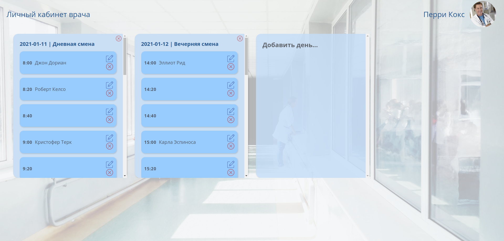

# Задание по курсу "Технологии Интернет"
## Личный кабинет врача госпиталя

## Задание 
Основной экран: личный кабинет врача в виде календаря, кнопка "добавить день" с выбором даты и смены, каждый день - список по времени с шагом 20 минут (8.00-14.00/14.00-20.00). На каждое время можно назначить прием пациента (при назначении вводим фамилию). Приемы можно отменять, дни можно удалять (но только если нет приемов в этот день).



## Технологии
- React & Redux - клиент
- Express - сервер

## Установка и запуск
1. Клонировать приложение
`git clone https://github.com/Stranger488/react-express-hospital-app.git`
и перейти в папку с проектом
`cd react-express-hospital-app`
2. Для запуска клиента
```
npm install
npm start
```
3. Для запуска сервера
```
node server/index.js
```

Клиент доступен по адресу *http://localhost:3000*

Сервер работает по адресу *http://localhost:4321*
